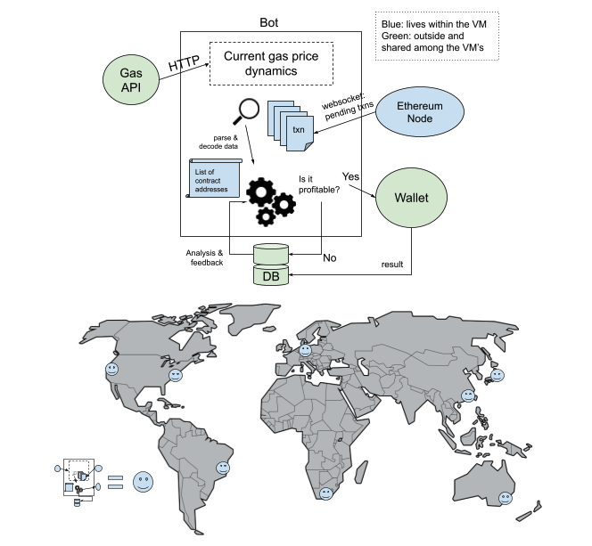

# Arbitrage Bot: Sandwich Attack on Uniswap

## Concept: 

We want to implement the design described in this research paper: https://arxiv.org/abs/2009.14021

## Data Pipeline:

1. Data collection: we will setup geth nodes (a client for Ethereum) that collect pending transactions from the Ethereum network. If we want to maximize our chances, we have to be the first one to spot the victim’s transaction.
2. Data processing: A script will iterate through all the pending transactions and look for those that interact with the [Uniswap contract](https://etherscan.io/address/0x7a250d5630b4cf539739df2c5dacb4c659f2488d). It will parse the transaction data and use the information there (target token, amount transferred, transaction fee, max slippage, etc.) to analyze if it’s profitable to initiate the attack. 
3. The attack: Send two txns that sandwich the victim's txn

## System Design: 

## Milestones:

Milestones are 1-2 week increments:
1. ~~Host a full geth node on an AWS EC2/Azure VM/AWS Managed Blockchain (AMB) and establish a websocket connection to a local script on the VM~~

2. ~~Write scripts to interact with a Gas API (there are multiple ones)~~
    1. We should also ask the bot to get new gas data periodically (30-60 minutes, we will try to tune it,) since gas prices fluctuate. 

3. Compile a list of token addresses that we want to target. This will be a static list that lives in each VM.

    1. Google Cloud Platform and AWS have nice query languages and datasets to collect such a static list efficiently. This would be queried once every couple weeks to refresh the static list.

4. Write the code that gives us money predicts if this transaction tv will be profitable

    * Optional: it helps to read through Uniswap’s smart contract solidity code

    1. tv has to interact with the Uniswap router and sends ether to an address on that token list

    2. Decode transaction data under `input` with Uniswap application binary interface

    3. Now with all the data parsed and decoded, develop a strategy (eg. trading logic) and implement the strategy in code

    4. Write code for Wallet to efficiently submit transactions. 

        1. There is a strategy here detailed in a few of the papers we looked at.

5. Set up node deployments so our blockchain clients can be distributed in multiple datacenters.

6. Set up a stream into a database from trading logic.

7. Write some straightforward analytics on our database.

8. If we have time at the end: write a frontend tool that tracks and visualizes all nodes and transactions, etc. 


## AMB Setup:

Currently, we have a full ethereum node hosted under [Amazon Managed Blockchain](https://console.aws.amazon.com/managedblockchain/home?region=us-east-1#firstRun) (AMB). Those .js scripts use Ethereum JSON-RPC API to interact with that node. We will update this README as we go (eg. add more nodes). 

You can either run your own node on AMB and use the scripts here to connect to it (the club can reimburse the cost, with a receipt of course), or you can connect to Cornell Blockchain's node. In that case, you have to dm me for access key and other credentials. 

1. You must have node version manager (nvm) and Node.js installed on your machine. Type `node --version` and verify that you are using Node version 14 or later. If necessary, you can use the `nvm install 14` command followed by the `nvm use 14` command to install version 14.
2. `npm install aws-sdk web3 xhr2`
3. Setup environment variables `AWS_ACCESS_KEY_ID`, `AWS_SECRET_ACCESS_KEY`, `AMB_HTTP_ENDPOINT`, and `AMB_WS_ENDPOINT` by typing `export AWS_ACCESS_KEY_ID="your_stuff"`
4. Run `node web3-http.js`. This script prints out data from [this txn](https://etherscan.io/tx/0xd82a86f8324fba7e0d374b461d6faf0c39a0d53fde06505d6c2cb8447609c617)
5. Run `node web3-websocket.js`. This scripts listens for pending txn and prints out those that interact with the Uniswap contract
